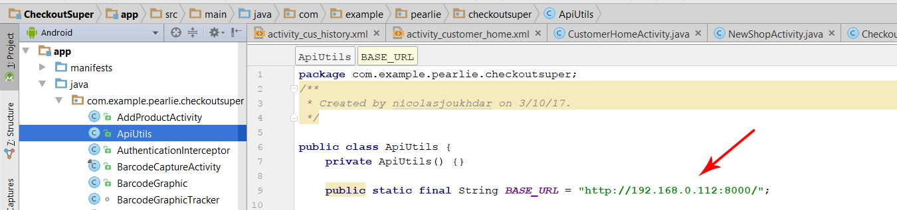

# SuperMarkt

SuperMarkt is an web shopping application for both users and store managers. It designed to allow managers of store branches to manage their stock and view data regarding their performace and allow users to see their transaction history of previous purchases on the companion mobile application.

## Getting Started

These instructions will allow you to set up and run the web application and populate the database with some dummy information for demonstration purposes.

### Prerequisites

What things you need to install the software and how to install them

```
Python3
VirtualEnv
```

### Installing

A step by step series of examples that tell you have to get a development env running

Firstly, make a python virtual environment

```
 virtualenv -p python3 [envname]
```

Next activate the virtual environment

```
source [path to virtualEnv]/bin/activate
```

Now install all the python requirements

```
pip install -r requirements.txt
```

Next generate django database migrations

```
python manage.py makemigrations
```

And finally, import the migrations

```
python manage.py migrate
```

### Running

To run the application, first do a ifconfig (ipconfig on Windows) to get the IP address of the computer you are using.  Then go into supermarket_manager/settings.py and add the IP address into the allowed host list (example below)

```
ALLOWED_HOSTS = ['192.168.43.73','127.0.0.1', '192.168.43.219', '192.168.43.209']
```

After that run the following command from the root of the web application (while still in the virtualenv) 

```
python manage.py runserver <youripaddress>:8000
```

### Launching the Mobile Application
First install Android Studios
```
https://developer.android.com/studio/install.html
```
Launch Android Studio and open the mobile application project.

Navigate to the file seen in the screenshot below and change the IP address in the file to the same IP address you used to run the django server.



Enable USB debuging on your Android phone.

Plug the phone into the PC.

Build the Android App by pressing the Build button or Shift+F10.

The App should now apear on your phone.

## Authors
* **Pearlie Zhang** - *Mobile Application*
* **Nicholas Joukhdar** - *Mobile Application*
* **Nathan Watkins** - *Web Application*
* **Kai Yang Lim** - *Web Application*
* **Jac Diamond** - *Web Application*


## License

This project is licensed under the COMP4920 license
